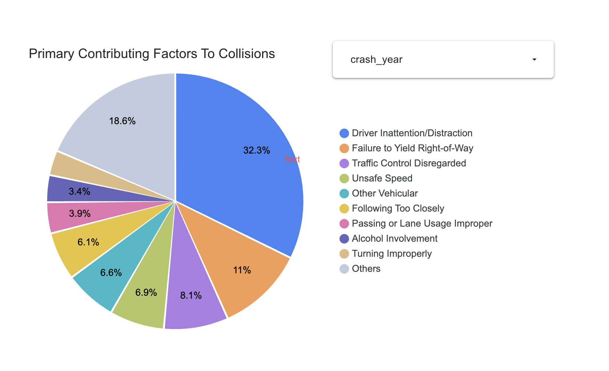
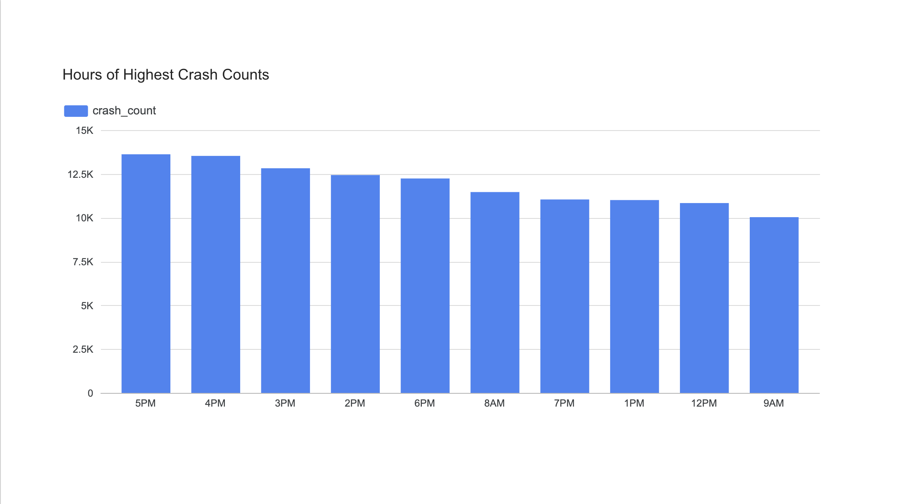
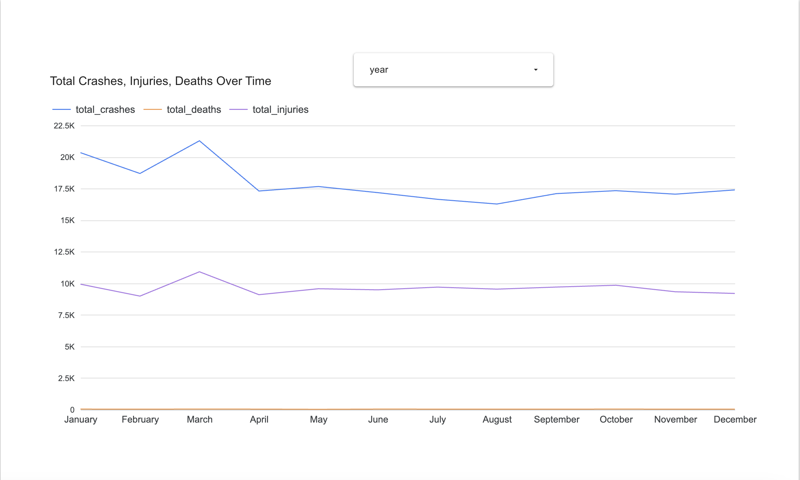
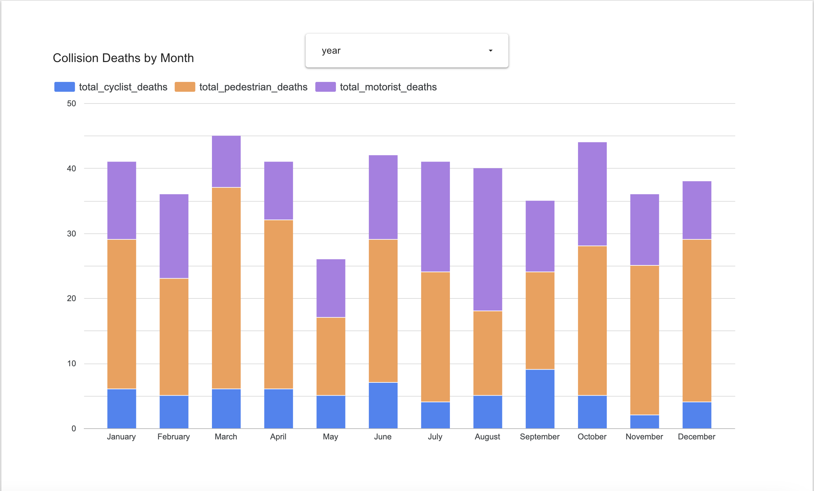
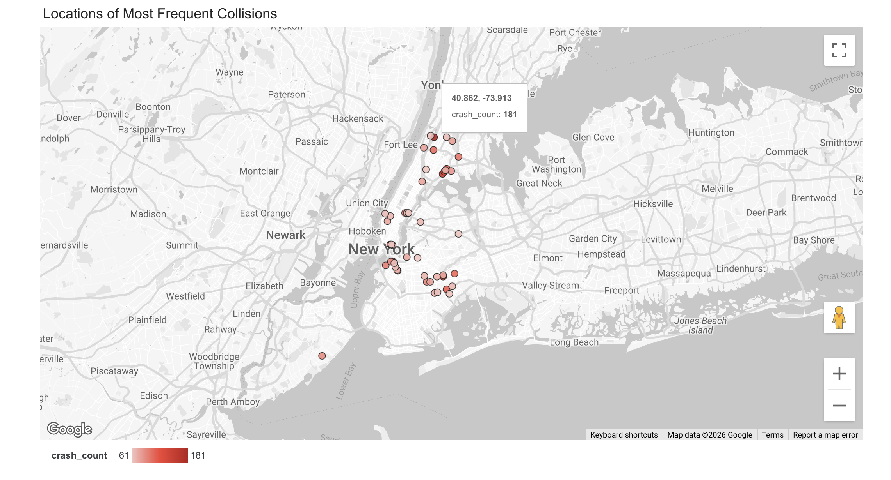

# Data Engineering Zoomcamp 2026 - Course Project

## NYC Motor Vehicle Collisions

An end-to-end batch data pipeline, facilitating analytics of New York City motor vehicle collision data over the last 3+ years.

## Table of Contents
- [Background](#-background)
- [Tech Stack](#-tech-stack)
- [Architecture](#-architecture)
- [Data Model](#-data-model)
- [Dashboard](#-dashboard)
- [Instructions To Run](#-instructions-to-run-the-project)
- [Prerequisites](#-prerequisites)


## Background

NYC Open Data allows citizens to review and engage with the information produced by the City government.  Through NYC Open Data, the New York City Police Department (NYPD) publishes motor vehicle collision  [data](https://data.cityofnewyork.us/Public-Safety/Motor-Vehicle-Collisions-Crashes/h9gi-nx95/about_data) compiled from all police-reported motor vehicle collisions in NYC.

In this project, 3+ years of data were extracted: years 2023 through 2025, and Year To Date 2026.

The goal of this project is to facilitate analytics regarding the collisions, for questions as follows:
- Why:  What are the most common factors contributing to collisions?
- When: Is there a seasonal pattern to collisions, what is the distribution of collisions through the months of the year.
- When: At what times of the day are collisions more frequent?
- Where: Where are collisions more frequently occurring?

## Tech Stack

| Category | Tool | 
| -------- | -------- | 
| Cloud | GCP |  |
| Infrastructure as Code  | Terraform  |   
| Workflow Orchestration  | Bruin  |   
| Ingestion (Batch) | Bruin (Python asset) |   
| Data Warehouse | Google BigQuery  |   
| Data Transformation | Bruin (SQL assets)
| Dashboard | Looker Studio  |   


## Architecture


This is an ELT pipeline, using Bruin for orchestration in each of the following steps.  The pipeline is scheduled for monthly batch processing.

- Extract: Ingestion occurs by querying the data from the NYC Open Data API endpoint.
- Load: The raw CSV data is loaded into Google Cloud Storage.
- Transform: Bruin is used for the data transformation into progressively more analysis-ready BigQuery tables.

## Data Model

4 layers:
- ingestion
- staging
- marts
- reporting

```
ingestion.collisions_raw   (External table, backed by GCS CSV files)
        ↓
staging.stg_collisions
    │ 
    │──→ marts.dim_date, marts.dim_time, marts.dim_location,
    │    marts.dim_vehicle, marts.dim_contributing_factor
    │ 
    │──→ marts.fct_vehicle_involvement ──────┐
    └──→ marts.fct_collisions                │ 
          │                                  │
          │──→ reports.crash_geo_hotspots ←──│────── marts.dim_location
          │──→ reports.crash_time_of_day ←───│────── marts.dim_time
          │──→ reports.crash_trend_detail ←──│────── marts.dim_date
          │──→ reports.crash_trend ←─────────│────── marts.dim_date
          │                                  ↓
          └──→ reports.reasons_highsev_collisions_byyear ←─ marts.dim_contributing_factor

```

## Dashboard

View the Looker Studio [dashboard](https://datastudio.google.com/reporting/c938be98-429c-4675-be4e-15210704e82f).








## Instructions to Run The Project

1.  Clone this project.
    ```
    git clone https://github.com/devmchou/nyc-vehicle-collisions.git
    cd nyc-vehicle-collisions
    ```

2.  Setup the [prerequisites](#-prerequisites).
3.  Install Python dependencies.
    ```
    uv sync
    ```

4.  Copy your service account key .JSON file to the   root of your project, where this project was cloned.

5.  Configuration files (3 total):

    The following configuration files contain some parameters which should be configured with your project-specific values.

      | Parameter      | Description | Example |
      | -------------- | ----------- | ----------- |
      | GCP_PROJECT_ID         | your GCP project id       | sonorous-antler-451234-r2 |
      | GCP-REGION         | your GCP region       | us-east1 |
      | GCP_PROJECT_NUMBER        | your GCP project number       | 888013011900 |
      | GCS_BUCKET_NAME      | your GCS bucket name        | nycdata_gcs_bucket_999073035123 |
      | GOOGLE_APPLICATION_CREDENTIALS         | absolute path to your service account key JSON file       | /Users/name/projects/de-zoomcamp-finalproject/sa-key.json|
      | RELATIVE_PATH_KEY_FILE         | relative path to your service account key JSON file       | ../sa-key.json|
      | SOCRATA_API_TOKEN      | NYC Open Data API token      | kcKh6jIddtkdPrJKI2StwQK8p  |

      

  - Copy the `.env.example` file to `.env`.  Then configure the values in the `.env` file.

    ```
    cp .env.example .env
    ```
    Configure the values in the `.env` file.

  - In the `terraform` directory, copy the `terraform.tfvars.example` file to
  `terraform.tfvars`.  
    ```
    cp terraform.tfvars.example terraform.tfvars
    ```
    Configure the values in `terraform.tfvars`.

  - Copy the `.bruin.yml.example` file to
  `.bruin.yml`.  
    ```
    cp .bruin.yml.example .bruin.yml
    ```
    Configure the values in `.bruin.yml`.

4.  Run Terraform to create the resources.
    ```
    terraform init
    terraform apply
    ```
    This creates the GCS bucket and Google BigQuery dataset.

5. Run Bruin pipeline with start and end dates specified.

    ```
    source .env

    uv run bruin . --start-date 2023-01-01 --end-date 2026-05-01
    ```

## Prerequisites
- Python 3.11+
- [uv]()
- [gcloud]()
- Setup authorization for Google Cloud SDK
- GCP project, with GCS and BigQuery enabled
- [Terraform](https://www.terraform.io/downloads)
- Bruin [CLI](https://github.com/bruin-data/bruin/tree/main/templates/zoomcamp#21-installation)
- Obtain app token from NYC Open Data

Setup Details:


  - <u>Setup GCP project</u>


    Create your project in Google Cloud Platform.

    With the project selected, under IAM & Admin / Service Accounts, create the service account with the following IAM roles at minimum:
    `Storage Admin, BigQuery Admin, Service Usage Consumer`.

    Create the service account key JSON file and download it.
    Copy this key file to your project root folder, where it was cloned.

   

  - <u>Setup Authorization for Google Cloud SDK</u>

    ```  
    gcloud auth application-default login
    ```

  - <u>NYC Open Data App Token</u>

    Register a user account at:
  https://data.cityofnewyork.us/signup.
  
     Then 
   sign up for an app token
    at https://dev.socrata.com/foundry/data.cityofnewyork.us/h9gi-nx95, clicking on "Sign up for app token" link, or alternatively create an app token at
    https://data.cityofnewyork.us/profile/edit/developer_settings.
    You will use this in your environment configuration in the steps above.
  


